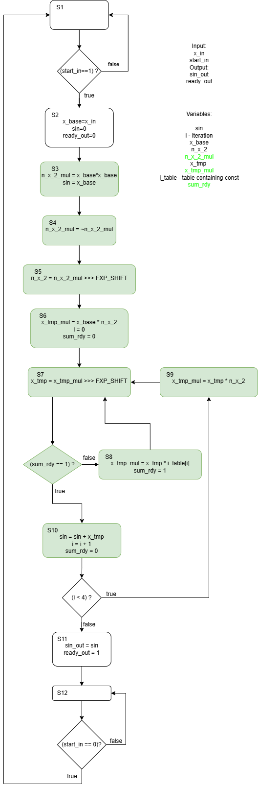

# FPGA_taylor_aproximation
SDUP project for TAYLOR aproximation on FPGA

# Systemy Dedykowane W Układach Programowalnych

## Autorzy
* **Wiktor Pantak**
* **Jan Rudecki**

# Strktura projektu:
* **project_1_sim** - projekt z plikami symulacyjnymi.
* **project_1_axi_mb** - zawiera projekt z implementacją hardware.

## Wstęp
Celem projektu było zaimplementowanie **szeregu Taylora** dla funkcji Sinus na FPGA **Zybo Zynq-7000 ARM/FPGA SoC Trainer Board**. Wykorzystywanym oprogramowaniem było Vivado 2023.2.2 oraz środowisko Pynq przystosowane na wykorzystywaną płytkę.

## Płytka Zynq-7000 ARM/FPGA SoC Trainer Board

__ZYBO__ (**ZY**nq **BO**ard) to bogate w funkcje, gotowe do użycia, podstawowe oprogramowanie wbudowane i platforma rozwoju obwodów cyfrowych, zbudowana wokół najmniejszego członka rodziny Xilinx Zynq-7000, Z-7010. Z-7010 jest oparty na architekturze Xilinx All Programmable System-on-Chip (AP SoC), która ściśle integruje dwurdzeniowy procesor ARM Cortex-A9 z logiką Xilinx 7-series Field Programmable Gate Array (FPGA).

## Implementacja Szeregu Taylora

Szereg Taylora jest przedstawieniem funkcji różniczkowalnej za pomocą sumy wielomianu n-tego stopnia. Poniżej znajduje się wykorzystany wzór szeregu Taylora dla Sinusa.

Pierwotny pomysł implementacji został przedstawiony na poniższym schemacie, zawiera on następujące funkcjonalne bloki:

* __*__    - Mnożenie
* __+__    - Dodawanie

Dodatkowo wartości początkowe, przedstawione w tabeli oraz zmienna wejściowa x.

Ostatecznie w implementacji wykorzystano pierwsze 4 iteracje, jest to spowodowane precyzją zmiennych, gdyż wykorzystujemy fixed point 12:10 i po piątej iteracji wyliczana wartość była zawsze równa 0.

Ostateczna implementacja w języku System Verilog jest przedstawiona poprzez poniższą maszynę stanów:

Algorytm uruchamia się w momencie, kiedy `start_in` wynosi 1, iteruje się łącznie 5 razy, z czego pierwsza iteracja następuje przed pętlą. Są przygotowane zmienne o dwa razy większej ilości bitów w celu przechowywania wyników mnożeń (zmienne _mul). Wartość `x_in` jest przekazywana do algorytmu w formacie FXP[12:10], a następnie przypisywana do zmiennej `x_base`. Wynik końcowy jest przypisywany do zmiennej `sin_out`, zmienna `ready_out` ustawia stan na "1", co informuje o zakończeniu algorytmu.

Całość implementacji znajduje się w repozytorium GitHub, pod linkiem: [FPGA Taylor Approximation](https://github.com/janek252/FPGA_taylor_aproximation.git)

## Wyniki symulacji algorytmu

Symulacja przedstawia zmiany kątów w zakresie od 0° do 45°, umożliwiając zaobserwowanie rzeczywistej wartości sinusa (**sin_expected**) oraz implementacji sprzętowej sinusa (**sin_actual**). Przedstawiono również procentowe pokrycie **sin_actual** przez **sin_expected** poprzez zmienną **delta**.

## Implementacja sprzętowa

W implementacji sprzętowej wykorzystano wymagane bloki:
* **ZYNQ7 Processing System** - odpowiada za procesor ARM 
* **AXI Interconnect** - magistrala AXI, wymagana do podłączenia procesora do taylor_ip
* **Processor System Reset** - system resetowania procesora
* **taylor_ip_v1.2** - implementacja hardware szeregu Taylora

W celu umożliwienia wykorzystania rejestrów w bloku `taylor_ip_v1.2` konieczne było ręczne dodanie ich, tak jak na zdjęciu poniżej:

Prezentacja layoutu implementacji bramek:

